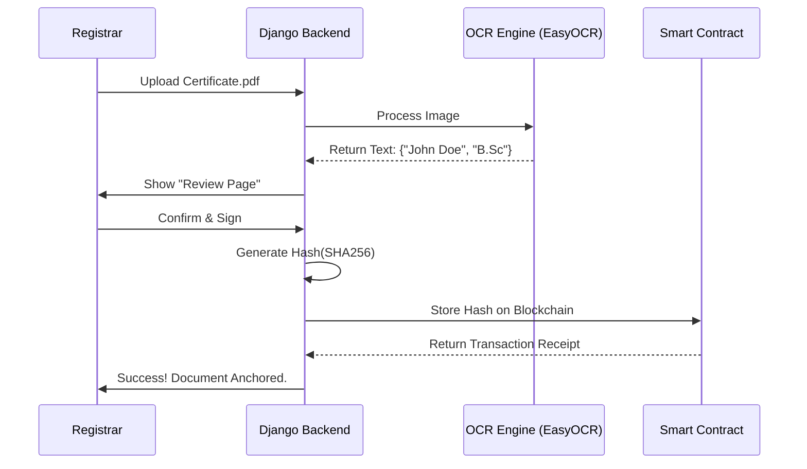

# 🛡️ Blockchain Document Verification System

[](https://www.python.org/)
[](https://www.djangoproject.com/)
[](https://github.com/JaidedAI/EasyOCR)
[](https://polygon.technology/)

**Document Verifier** is a decentralized application (DApp) designed to combat document forgery. It allows institutions to issue tamper-proof digital credentials and enables third parties to instantly verify them using the Polygon blockchain, acting as a "Trustless" source of truth.

> **Note**: This is a final year college project demonstrating the application of Blockchain and Optical Character Recognition (OCR) in EdTech.

---

## 📑 Table of Contents
1. [Executive Summary](#-executive-summary)
2. [Key Features](#-key-features)
3. [System Architecture](#-system-architecture)
4. [Application Modules & Pages](#-application-modules--pages)
5. [Workflow Diagram](#-workflow-diagram)
6. [Technology Stack](#-technology-stack)
7. [Installation Guide](#-installation-guide)

---

## 🚀 Executive Summary

**The Problem**: Degree forgery is a significant issue, and traditional verification (emailing universities) is slow and manual.
**The Solution**: We generate a unique cryptographic hash called a "Digital Fingerprint" for every document. This hash is stored on an immutable blockchain.
**The Innovation**: Unlike traditional hashing, we use **AI-based OCR (EasyOCR)** to extract student data first, ensuring that verification is intelligent and data-aware, not just a blind file match.

---

## ✨ Key Features

- **Immutable Records**: Once a document hash is stored on the blockchain, it cannot be altered or deleted.
- **AI-Powered Extraction**: Automatically reads Student Name, Degree, and Date from uploaded certificates using Python's `EasyOCR`.
- **QR Code Verification**: Generates a verifiable QR code for easy scanning.
- **Tamper Detection**: Instantly detects if a single pixel or character has been changed in the document.
- **Privacy Centric**: Student grades and private data remain properly secured in the local database; only the *hash* is public.

---

## 🏗 System Architecture

The project follows a **Hybrid Implementation**:
1.  **Off-Chain (Local DB)**: Stores the heavy files, user accounts, and OCR text.
2.  **On-Chain (Blockchain)**: Stores *only* the cryptographic proof (SHA-256 Hash).

### Modules
1.  **Core Web Module**: Django-based backend handling user sessions and logic.
2.  **OCR Module**: Local Python processing utilizing `EasyOCR` (or `Tesseract`) to convert images/PDFs to text without API costs.
3.  **Blockchain Module**: `Web3.py` scripts to interact with a smart contract deployed on the Polygon Testnet (Amoy) or Ganache.

---

## 📱 Application Modules & Pages

The application is divided into three distinct portals:

### 1. Public Landing Page
- **Purpose**: Introduction to the platform.
- **Features**:
    - "Verify Now" Quick Search Bar.
    - Information about the technology.
    - Login/Signup buttons for Institutions.

### 2. Issuer Dashboard (University/Admin)
*Restricted Access: Only for Registrar/Admin.*
- **Login Page**: Secure authentication.
- **Upload Document Page**:
    - Drag & Drop interface for Certificates (PDF/JPG).
    - **Action**: Triggers the OCR pipeline on upload.
- **Review & Mint Page**:
    - Displays the **Scanned Image** alongside **Extracted Text** fields (Name, Reg No, GPA).
    - **Editable Fields**: Allows the registrar to correct any OCR mistakes before finalization.
    - **"Mint to Blockchain" Button**: Hashes the final data and sends the transaction.
- **History Log**: List of all previously issued documents with their Transaction IDs (TX Hash).

### 3. Verification Portal (Verifiers/Students)
*Public Access: No Login Required.*
- **File Upload Verification**: User uploads a suspicious file. The system re-hashes it and checks the On-Chain Registry.
- **Manual Input Verification**: User types a unique "Document ID" to fetch current validity status.
- **Result Page**:
    - **Green Badge**: "Verified: Issued by [University Name] on [Date]."
    - **Red Badge**: "Tampered: Content does not match records."

---

## 🔄 Workflow Diagram



---

## 🛠 Technology Stack

### Backend
- **Framework**: Django 5.0 (Python)
- **Database**: SQLite (Dev) / PostgreSQL (Prod)
- **Image Processing**: OpenCV & Pillow
- **OCR Engine**: `EasyOCR` (runs locally, GPU/CPU supported)

### Blockchain
- **Interface**: Web3.py
- **Smart Contract**: Solidity (Remix IDE)
- **Network**: Ganache (Local Sandbox) or Polygon Amoy Testnet

### Frontend
- **Templates**: HTML5, CSS3, Bootstrap 5 / Tailwind CSS
- **Interactivity**: Vanilla JavaScript

---

## ⚙️ Installation Guide

1. **Clone the Repo**
   ```bash
   git clone https://github.com/yourname/certify-chain.git
   cd certify-chain
   ```

2. **Install Dependencies**
   ```bash
   pip install -r requirements.txt
   # Ensure torch and easyocr are installed
   ```

3. **Setup Blockchain Env**
   - Install **Ganache** (for local testing).
   - Update `settings.py` with your Wallet Private Key and RPC URL.

4. **Run Server**
   ```bash
   python manage.py migrate
   python manage.py runserver
   ```
